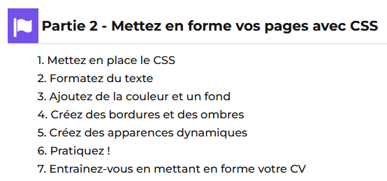

# Etape 2 - Entraînez-vous en mettant en forme votre CV

**À vous de jouer !** Pour vous entraîner, réalisez cet exercice étape par étape. 
Une fois que vous avez terminé, vous pouvez comparer votre travail avec les pistes que je vous propose.

Une fois que vous avez terminé, vous pouvez comparer, auto-évaluer, votre
travail avec ma **Check-list**

## Contexte

Vous cherchez du travail et vous avez créé votre CV en ligne en y ajoutant les informations
de votre parcours professionnel. Cependant, pour que votre CV attire l’œil des recruteurs,
**une mise en forme impeccable est nécessaire**. 

Pour cela, vous allez devoir **enrichir votre page HTML avec du .CSS**.

**Avant de commencer**, réaliser les 7 chapitres de la [Partie 2 - Mettez en place le CSS ](https://openclassrooms.com/fr/courses/1603881-apprenez-a-creer-votre-site-web-avec-html5-et-css3/1605060-mettez-en-place-le-css)
, le 7e étant cet exercice 😀

## Votre mission

* Étape 1 : Créer une nouvelle branche `étape_02_nom_prenom` si c'est pas déjà fait.
* Étape 2 : Créer un fichier `main.css` et ajoutez-y les effets de style CSS suivants :
  * changer la couleur d'un des textes ;
  * changer l'alignement d'un des textes ;
  * appliquer une image de fond à la page ;
  * utiliser une police personnalisée via @font-face ;
  * définir la bordure d'un élément ;
  * définir l'ombre d'un élément.

## Check-list

✅ Vous avez un fichier `.html` et un fichier `.css`.

✅ Votre fichier `.css` est classé dans un dossier `css/`.

✅ La couleur d’un des textes est changée.

✅ L’alignement d’un des textes est changé.

✅ Une image de fond est appliquée à la page.

✅ Une police personnalisée est utilisée via `@font-face`.

✅ La bordure d’un élément est définie.

✅ L’ombre d’un élément est définie.

## Exemples de solutions
* https://divtec-cejef.github.io/101-SFA-HTML-CV-02/
* https://static.oc-static.com/activities/199/evaluation_resources/mettez-en-forme-votre-cv_exemple-2019-01-03T082017.zip
